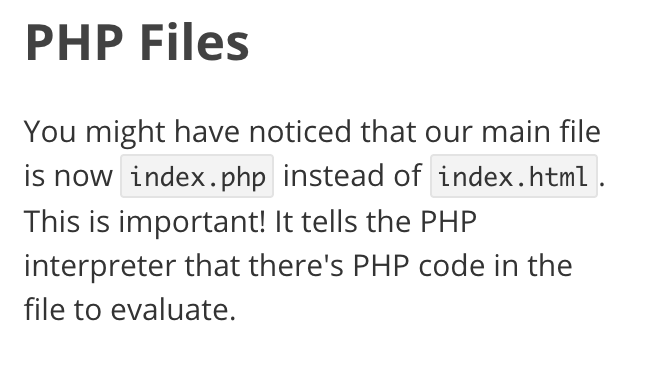
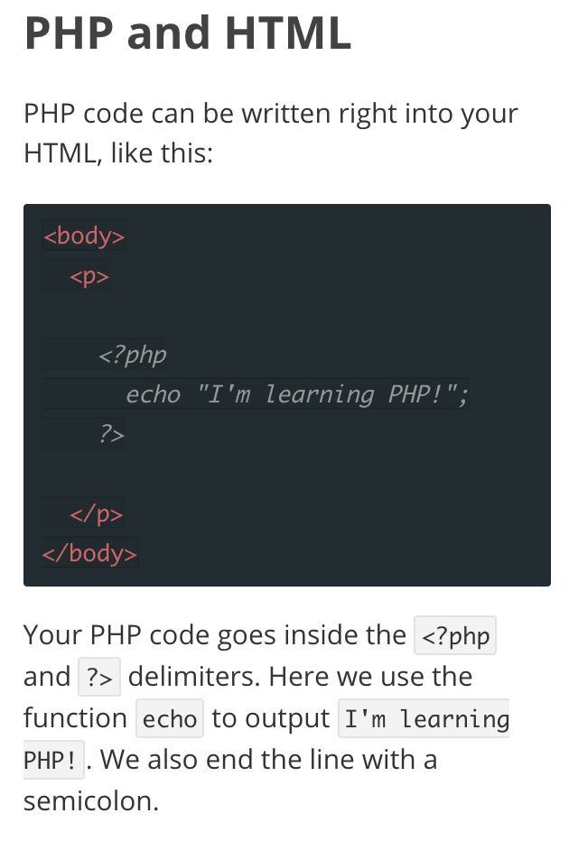
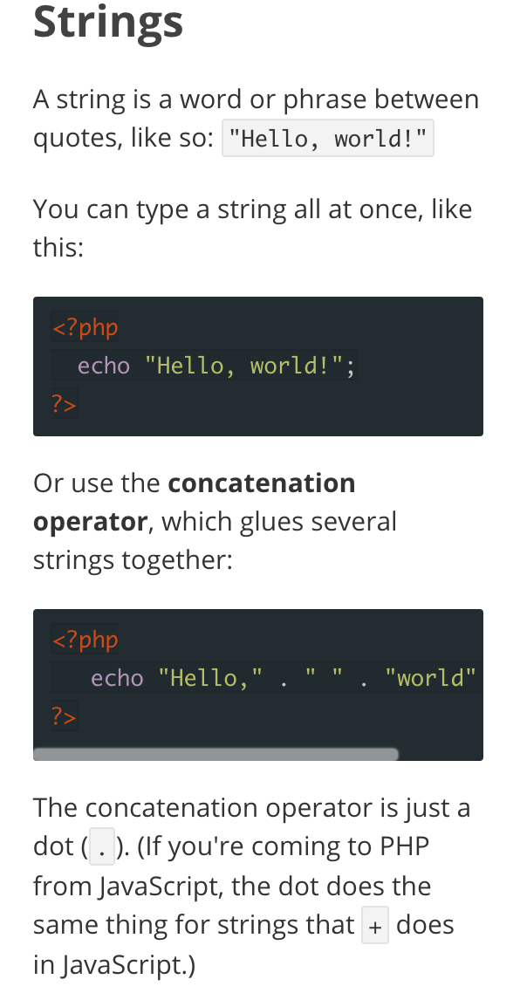

# Wordpress-Tutorial
## Introduction to Wordpress

 "WordPress is an online, open source website creation tool written in PHP. But in non-geek speak, it's probably the easiest and most powerful blogging and website content management system (or CMS) in existence today."

###What Is WordPress?

  * Personal publishing system built on PHP and MySQL
  * Started in 2001
  * Focuses on ease of use and speed for a great user experience

###Why Use WordPress?
  * Comes with a bunch of pre-loaded features
  * User-friendly

## Difference Between WordPress.com and WordPress.org

  The major difference between WordPress.com and WordPress.org is who's actually hosting your website. With WordPress.org, YOU host your own blog or website. WordPress.org is where you'll find the free WordPress software that you can download and install on your own web server. If you use WordPress.com you are provided with the WordPress software as a service which is ready to use.

  Here's a link to see all of the differences between WordPress.com and WordPress.org [Click Here!](http://www.wpbeginner.com/beginners-guide/self-hosted-wordpress-org-vs-free-wordpress-com-infograph/?display=wide)

  Most businesses and individuals use WordPress.org, which allows for plugins. :slightly_smiling_face: we like plugins! — Plugins are a way to add functionality that already exists in WordPress. (We'll get more in depth with plugins in a bit!)

## Installing Wordpress

####To Install WordPress:
  1. Visit the [WordPress](https://wordpress.org) website and click on download wordpress.

  
  2. Set up a database for your WordPress. You can buy server space from some of their local partners called Dreamhost or Siteground. We decided to use MAMP as it is free.
  3. Open the read.me inside wordpress.zip
  4. Follow onscreen installation instructions for the the famous 5-minute install!

### What is MAMP?

  MAMP stands for Macintosh, Apache, MySQL and PHP. Basically, it is a free application you can install on your Mac laptop or desktop computer that gives you access to a local Apache server. MAMP allows you to build and test WordPress sites offline, entirely on your own computer.

##Themes and Child Themes

  

  Part of why people love and hate WordPress is the Themes. Themes make styling your website a breeze! You basically don't have to code!(That's no fun!) But a lot of people complain that all WordPress sites look the same. You can however take styling into your own hands by modifying the default theme style.

  "The biggest disadvantage is that any modifications made to the theme in this way will be lost once the theme is updated by the developer. As a consequence, users either won’t be able to keep their theme up to date (which is bad for security) or will find all of their customizations gone when they do."

  The best way to get around this is to use a child theme. This allows you to make any number of changes to your website's styling without touching any of the original theme files.

## How To Install Plugins
  * Plugins ONLY available with Wordpress.org (not Wordpress.com)
  * To find a plugin, do a search for 'Wordpress Plugins
  * The site we used is [Plugins](https://wordpress.org/plugins)
  * Go to the website for the plugin... in our case it was [JetPack](https://jetpack.com/support/installing-jetpack)
  * Go to your [Dashboard] (localhost:888/wordpress/wp-admin)
  * Click on [Plugins | Add New | Install Now](http://localhost:8888/wordpress/wp-admin/plugin-install.php) ... and Voila! you're ready to go!

* Jetpack is an example of a plugin that helps the speed of your site, you can view your stats, and protect yourself from hackers!

#PHP ?!?

  

  

  PHP (recursive acronym for PHP: Hypertext Preprocessor) is a widely-used open source general-purpose scripting language that is especially suited for web development and can be embedded into HTML.

  PHP, on the other hand, runs on the same computer as the website you're visiting, which is known as the server. This means that it has access to all the information and files on that machine, which allows it to construct custom HTML pages to send to your browser, handle cookies, and run tasks or perform calculations with data from that website.

  embedded PHP seems to be pretty similar to the way we learned to embed Ruby or JavaScript. There are just some syntactical differences that we all would pick up pretty quickly since we're all bad-ass programmers now. :slightly_smiling_face:

  

  An example of the differences is how you concatenate in PHP:

  

  The concatenation operator is just a dot (.).  Coming to PHP from JavaScript, the dot does the same thing for strings that + does in JavaScript.

  We recommend using the Codecademy PHP tutorials to familiarize yourself with the differences between it and the other languages we're familiar with! [Click Here](https://www.codecademy.com/learn/php)
